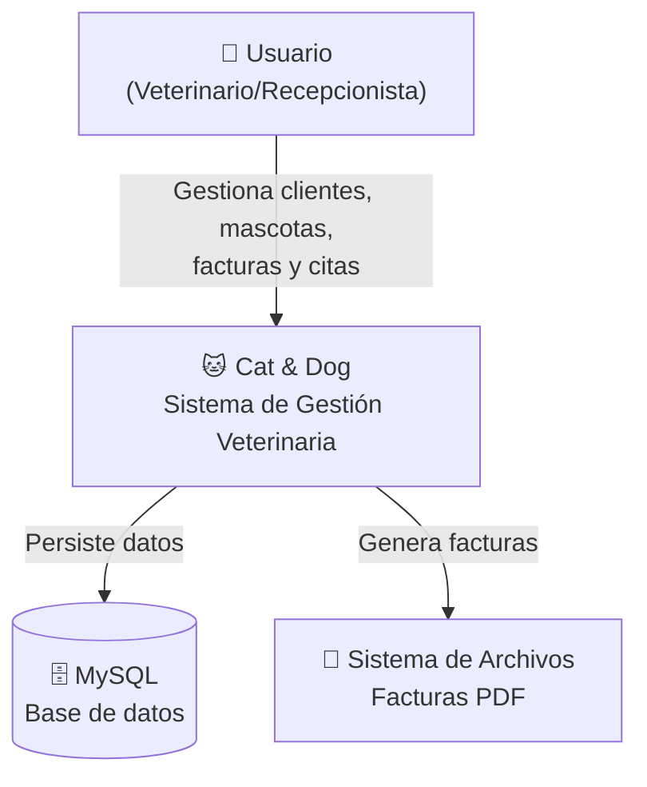
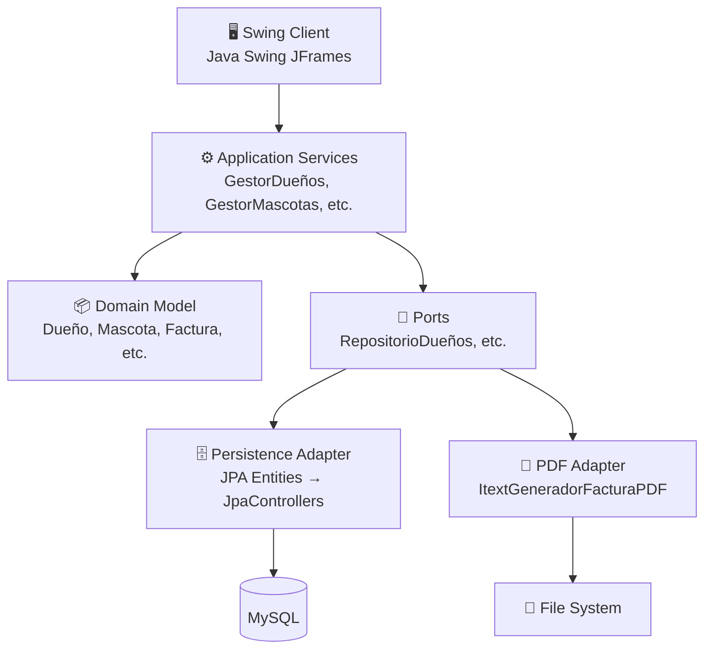
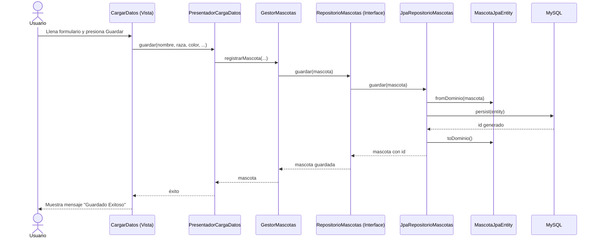

# Cat & Dog — Documentación de Arquitectura

## Stack Tecnológico

| Componente | Tecnología |
|---|---|
| Lenguaje | Java 21 |
| UI | Swing (NetBeans GUI Builder) |
| ORM | EclipseLink (JPA 2.2) |
| Base de datos | MySQL 8 |
| PDF | iText 5.5.13 |
| Build | Maven |
| Tests | JUnit 5 + Mockito |

## Arquitectura: Clean Architecture (Hexagonal)

```
┌─────────────────────────────────────────────────────┐
│                     GUI (Swing)                      │
│   Vista ←→ Presentador ←→ Controladora (legacy)     │
├─────────────────────────────────────────────────────┤
│               Aplicación (Servicios)                 │
│   GestorDueños, GestorMascotas, GestorAgenda, etc.  │
├─────────────────────────────────────────────────────┤
│               Dominio (Modelo + Puertos)             │
│   Dueño, Mascota, Servicio, Factura, Agenda         │
│   RepositorioDueños, RepositorioMascotas, ...        │
├─────────────────────────────────────────────────────┤
│            Infraestructura (Adaptadores)             │
│   JPA Entities → JpaControllers → MySQL             │
│   ItextGeneradorFacturaPDF → Archivos PDF           │
│   Configuracion → application.properties             │
└─────────────────────────────────────────────────────┘
```

## Estructura de Paquetes

```
com.ut.catanddog.catanddog/
├── dominio/
│   ├── modelo/           → Dueño, Mascota, Servicio, Factura, Agenda (POJOs puros)
│   └── puertos/          → Interfaces de repositorio (contractos)
├── aplicacion/
│   └── servicios/        → GestorDueños, GestorMascotas, GestorAgenda, etc.
├── infraestructura/
│   ├── config/           → Configuracion (properties externas)
│   ├── persistencia/     → JPA entities, JpaControllers, JpaRepositorios
│   └── pdf/              → ItextGeneradorFacturaPDF
├── GUI/
│   ├── presentadores/    → PresentadorAgendar, PresentadorCargaDatos, etc.
│   └── *.java            → Vistas Swing (JFrame, JDialog)
└── Logica/               → Legacy (Controladora, Dueño, Mascota, etc.)
    └── Persistencia/     → Legacy (JpaControllers viejos)
```

## C4 Diagrams

### Nivel 1 — Contexto del Sistema



### Nivel 2 — Contenedores



### Nivel 3 — Componentes (Flujo: "Registrar Mascota")



## Decisiones Arquitectónicas

### 1. Entidades JPA separadas del modelo de dominio

**Problema:** El código original usaba las mismas clases (`Logica.*`) como entidades JPA y modelo de negocio, acoplando la BD a la lógica.

**Decisión:** Crear `dominio.modelo.*` (POJOs puros sin anotaciones) y `infraestructura.persistencia.*JpaEntity` (con anotaciones JPA), con métodos `toDominio()`/`fromDominio()` para convertir entre capas.

**Beneficio:** El dominio no depende de JPA, se puede probar unitariamente, y cambiar de ORM no afecta la lógica de negocio.

### 2. MVP (Model-View-Presenter) en la GUI

**Problema:** Las ventanas Swing tenían lógica de negocio mezclada con código de UI.

**Decisión:** Extraer presentadores (`GUI.presentadores.*`) que contienen la lógica de interacción. Las vistas solo manejan eventos de UI y delegan al presentador.

**Beneficio:** Las vistas son "tontas" y reemplazables. Los presentadores se pueden probar con mocks.

### 3. Puertos y Adaptadores (Hexagonal)

**Problema:** El código dependía directamente de implementaciones concretas (JpaController, PersistenceFacade).

**Decisión:** Definir interfaces en `dominio.puertos.*` y hacer que `infraestructura.persistencia.*` las implemente.

**Beneficio:** Se puede cambiar la implementación (ej: JPA → JDBC, MySQL → PostgreSQL) sin tocar el dominio ni la aplicación.

### 4. Configuración externalizada

**Decisión:** Las credenciales de BD ya no están hardcodeadas en `persistence.xml`. Se leen de `application.properties` (classpath) con override opcional via `config/db.properties` externo.

### 5. Legacy como puente

**Decisión:** El paquete `Logica.*` y `Persistencia.*` original se conserva intacto para no romper código que aún lo referencie. El nuevo código usa las nuevas capas.

## Pruebas

```bash
mvn test
```

| Capa | Tests | Estado |
|---|---|---|
| `dominio.modelo` | 40 | ✅ |
| `aplicacion.servicios` | 20 | ✅ |
| **Total** | **60** | **✅** |

## Configuración

Archivo `src/main/resources/application.properties`:

```properties
db.url=jdbc:mysql://localhost:3306/catanddog?serverTimezone=UTC
db.user=catanddog
db.password=admin
persistence.unit.name=CatandDogPU
facturas.output.dir=C:/Facturas/
```

Para sobreescribir en producción, crear `config/db.properties` (ignorado por git):

```properties
db.password=contraseña_real
```

## Cómo agregar una nueva funcionalidad

1. **Dominio:** Agregar la clase en `dominio.modelo` con su lógica de negocio
2. **Puerto:** Definir interfaz en `dominio.puertos`
3. **Infraestructura:** Crear JPA entity (con `toDominio`/`fromDominio`) y repositorio que implemente el puerto
4. **Aplicación:** Crear Gestor* que use el repositorio
5. **GUI:** Crear Presentador* y vista Swing, o agregar a uno existente
6. **Tests:** Escribir tests unitarios para dominio y aplicación
